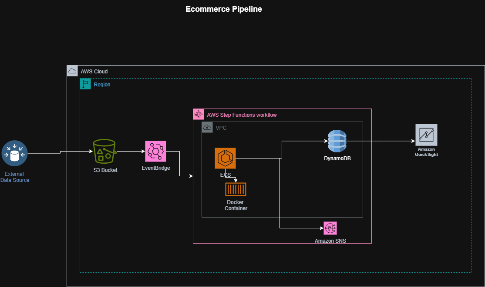
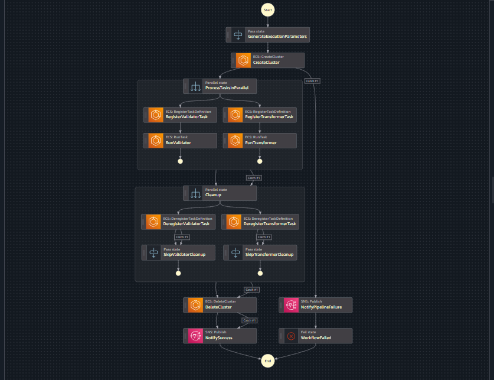
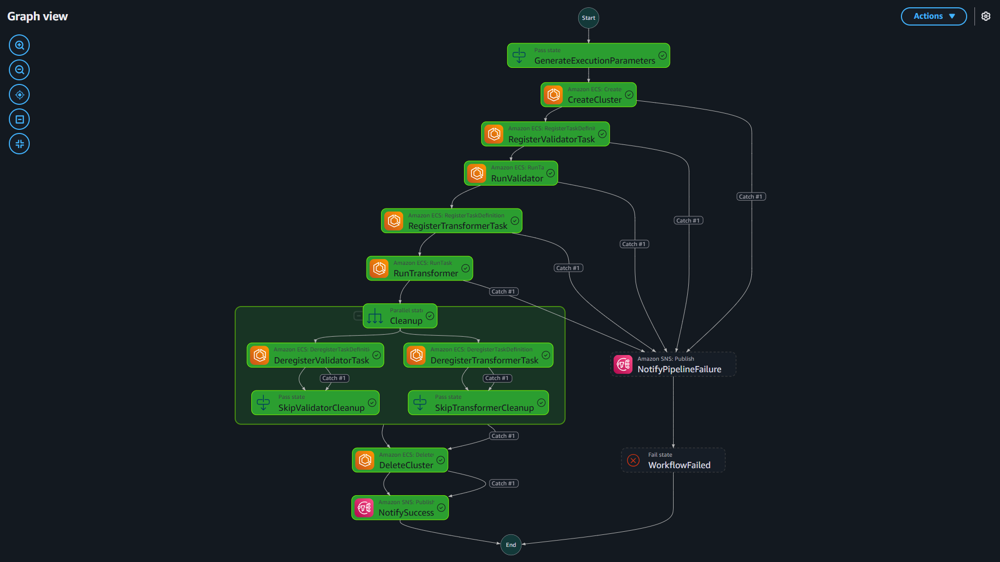
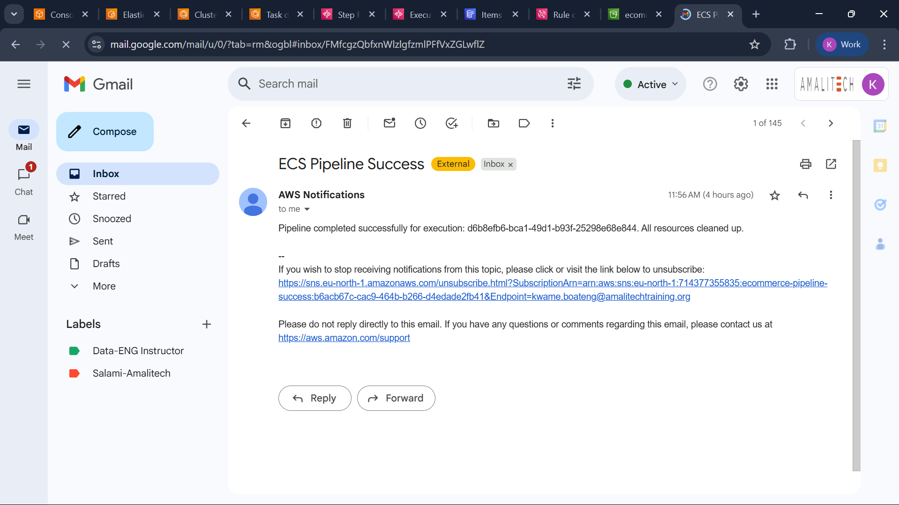
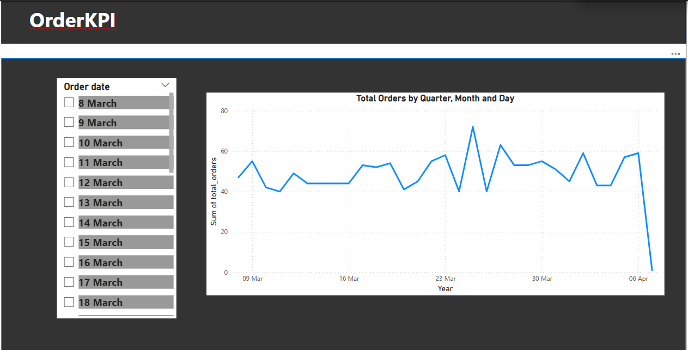
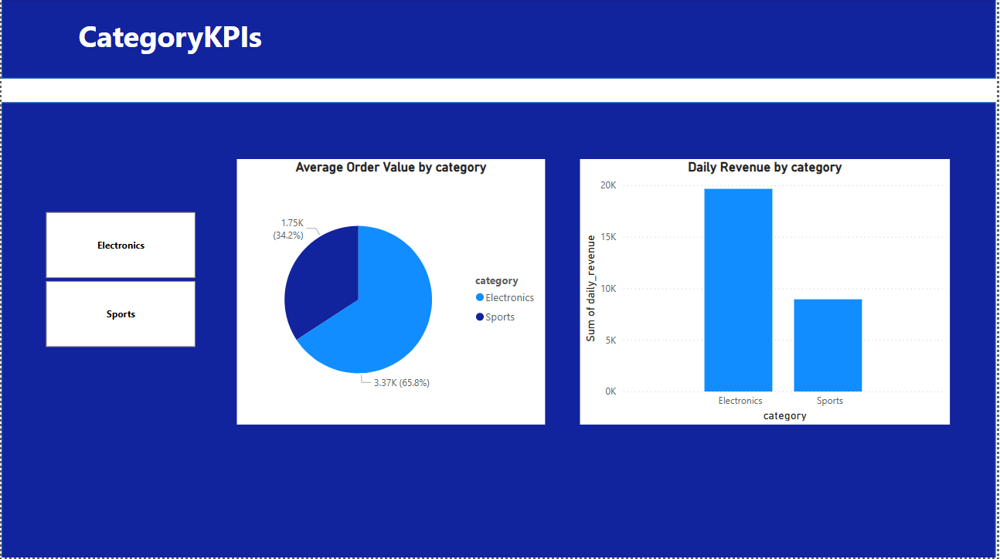

# ECS Event-Driven Data Pipeline

## Overview

This project implements a **real-time, event-driven data pipeline** for an e-commerce platform, designed to process transactional data (orders, products) arriving as CSV files in an Amazon S3 bucket. The pipeline leverages AWS-native services to validate and transform data using containerized tasks on Amazon ECS (Fargate), compute business KPIs, store results in Amazon DynamoDB for real-time querying, and orchestrate the workflow with AWS Step Functions. Amazon EventBridge triggers the pipeline on S3 uploads, replacing the Lambda trigger for enhanced event management. The solution includes automated resource cleanup, error handling, SNS notifications, and CloudWatch logging. Business intelligence dashboards are powered by **Amazon QuickSight** and **Power BI**, providing actionable insights into Category-Level and Order-Level KPIs.

### Key Features
- **Event-Driven Architecture**: Amazon EventBridge triggers the pipeline on S3 `ObjectCreated` events, ensuring real-time processing.
- **Containerized Processing**: ECS Fargate runs isolated validator and transformer tasks in parallel for scalability.
- **Automated Orchestration**: AWS Step Functions manages cluster creation, task execution, cleanup, and file archiving.
- **Optimized KPI Storage**: DynamoDB stores Category-Level and Order-Level KPIs with efficient access patterns.
- **Ephemeral Resources**: ECS clusters and task definitions are dynamically provisioned and cleaned up to avoid orphaned resources.
- **Monitoring and Alerts**: CloudWatch logs task execution, and SNS sends success/failure notifications.
- **Dashboards**: QuickSight and Power BI visualize KPIs for business users.
- **CI/CD Integration**: GitHub Actions automates deployment and validation.

### Architecture Diagram



The data flow is:
1. CSV files are uploaded to an S3 bucket (`<YOUR_INPUT_BUCKET>/input/`).
2. EventBridge detects the upload and triggers the Step Functions state machine.
3. Step Functions creates an ECS cluster, runs validator and transformer tasks in parallel.
4. Validated data is transformed into KPIs, written to DynamoDB, and the input file is archived to `<YOUR_CLEANED_BUCKET>/processed/`.
5. The ECS cluster and task definitions are cleaned up.
6. SNS notifications report success or failure.
7. QuickSight and Power BI dashboards visualize KPIs.

## Repository Structure

```
ecs-event-driven-pipeline/
├── .github/
│   └── workflows/
│       └── main.yml                         # GitHub Actions CI/CD pipeline
├── step_functions/
│   └── MainStepFn.json                      # Step Functions state machine JSON
├── iam/
│   └── ecs-task-role-policy.json            # IAM policy for ECS task role
├── ecs/
│   ├── validator/
│   │   ├── Dockerfile                       # Dockerfile for validator container
│   │   ├── validator.py                     # Python logic for data validation
│   │   └── requirements.txt                 # Validator dependencies
│   ├── transformer/
│   │   ├── Dockerfile                       # Dockerfile for transformer container
│   │   ├── transformer.py                   # Python logic for KPI computation
│   │   └── requirements.txt                 # Transformer dependencies
├── lambda/
│   ├── eventbridge_trigger/
│   │   ├── lambda_function.py               # Lambda function for EventBridge (optional fallback)
│   │   └── requirements.txt                 # Lambda dependencies
├── data/
│   ├── products/
│   │   └── sample_products.csv              # Sample product data
│   ├── orders/
│   │   ├── valid_order.csv                  # Sample valid order CSV
│   │   └── invalid_order.csv                # Sample invalid order CSV
│   ├── order_items/
│   │   └── sample_order_items.csv           # Sample order items data
├── tests/
│   └── test_pipeline.sh                     # Pipeline simulation script
├── imgs/
│   ├── Architecture.jpg                     # Pipeline architecture diagram
│   ├── stepfunctions.svg                    # Step Functions workflow diagram
│   ├── executed.svg                         # Executed Step Functions graph
│   ├── SNS-email.png                       # SNS notification example
│   ├── order_kpi.png                       # Power BI Order KPIs dashboard
│   ├── category_kpi.png                    # Power BI Category KPIs dashboard
├── .gitignore                               # Ignores credentials, temp files
├── LICENSE                                  # MIT License
├── README.md                                # This project documentation
└── requirements.txt                         # Development dependencies
```

### Directory and File Descriptions
- **`.github/workflows/main.yml`**: GitHub Actions workflow for CI/CD, validating JSON and deploying resources.
- **`step_functions/MainStepFn.json`**: Step Functions state machine definition for pipeline orchestration.
- **`iam/ecs-task-role-policy.json`**: IAM policy for ECS tasks, granting S3 read and DynamoDB write permissions.
- **`ecs/validator/Dockerfile`**, **`ecs/validator/validator.py`**, **`ecs/validator/requirements.txt`**: Container build and logic for validating CSV data.
- **`ecs/transformer/Dockerfile`**, **`ecs/transformer/transformer.py`**, **`ecs/transformer/requirements.txt`**: Container build and logic for KPI computation and DynamoDB writes.
- **`lambda/eventbridge_trigger/lambda_function.py`**, **`lambda/eventbridge_trigger/requirements.txt`**: Optional Lambda function for EventBridge fallback or custom triggers.
- **`scripts/deploy.sh`**: Deploys S3 buckets, DynamoDB tables, ECS repositories, EventBridge rules, and Step Functions.
- **`scripts/undeploy.sh`**: Cleans up deployed resources.
- **`scripts/validate_json.sh`**: Validates `MainStepFn.json` syntax using `jq`.
- **`data/products/sample_products.csv`**: Sample product data for reference or testing.
- **`data/orders/valid_order.csv`**, **`data/orders/invalid_order.csv`**: Sample order CSVs for testing.
- **`data/order_items/sample_order_items.csv`**: Sample order items for extended testing.
- **`tests/test_lambda.py`**: Unit tests for the Lambda function (if used).
- **`tests/test_pipeline.sh`**: Script to simulate pipeline execution.
- **`docs/architecture.md`**: Detailed architecture with diagrams.
- **`docs/setup.md`**: Step-by-step setup instructions.
- **`docs/testing.md`**: Testing guidelines for manual and automated tests.
- **`docs/troubleshooting.md`**: Solutions for common issues.
- **`imgs/`**: Visual assets for architecture, Step Functions, SNS, and dashboards.
- **`.gitignore`**: Excludes sensitive files (e.g., `.env`, `*.pyc`, AWS credentials).
- **`LICENSE`**: MIT License for open-source usage.
- **`requirements.txt`**: Development dependencies (e.g., `boto3`, `pytest`).

## Prerequisites

- **AWS Account** with permissions for:
  - Amazon S3 (bucket creation, event notifications)
  - Amazon ECS (Fargate cluster/task management)
  - AWS Step Functions (state machine execution)
  - Amazon DynamoDB (table creation/writes)
  - Amazon EventBridge (event rules)
  - Amazon SNS (notifications)
  - Amazon CloudWatch (logging)
  - AWS IAM (role/policy management)
  - Amazon ECR (container image storage)
  - Amazon QuickSight (dashboards)
- **AWS CLI** configured (`aws configure`).
- **Docker** for building/pushing container images.
- **Python 3.9+** for Lambda and scripts.
- **IAM Roles** (replace ARNs with your own):
  - `ecsTaskExecutionRole`: `AmazonECSTaskExecutionRolePolicy`.
  - `ecsTaskRole`: S3 read, DynamoDB write permissions (see `iam/ecs-task-role-policy.json`).
  - `stepFunctionsExecutionRole`: ECS, SNS, and EventBridge permissions.
  - `eventbridgeLambdaRole` (optional): EventBridge and Step Functions permissions.
- **ECR Repositories**:
  - `<AWS_ACCOUNT_ID>.dkr.ecr.<YOUR_REGION>.amazonaws.com/ecs-validator:latest`
  - `<AWS_ACCOUNT_ID>.dkr.ecr.<YOUR_REGION>.amazonaws.com/ecs-transformer:latest`
- **S3 Buckets**:
  - `<YOUR_INPUT_BUCKET>`: For input CSVs (`input/` prefix).
  - `<YOUR_CLEANED_BUCKET>`: For processed files (`processed/` prefix).
- **SNS Topics**:
  - `arn:aws:sns:<YOUR_REGION>:<AWS_ACCOUNT_ID>:pipeline-success`
  - `arn:aws:sns:<YOUR_REGION>:<AWS_ACCOUNT_ID>:pipeline-failure`
- **CloudWatch Log Group**: `/aws/ecs/ephemeral-pipeline`
- **DynamoDB Tables**:
  - `CategoryKPIs`
  - `OrderKPIs`

**Note**: Replace placeholders (e.g., `<AWS_ACCOUNT_ID>`, `<YOUR_REGION>`, `<YOUR_INPUT_BUCKET>`) with your actual AWS resource values.

## Data Flow and Architecture

1. **S3 Upload**: CSV files are uploaded to `<YOUR_INPUT_BUCKET>/input/`.
2. **EventBridge Rule**: Detects `ObjectCreated` events and triggers the Step Functions state machine.
3. **Step Functions**:
   - Creates an ephemeral ECS cluster.
   - Runs validator (`ecs/validator/validator.py`) and transformer (`ecs/transformer/transformer.py`) tasks in parallel.
   - Writes KPIs to DynamoDB (`CategoryKPIs`, `OrderKPIs`).
   - Archives files to `<YOUR_CLEANED_BUCKET>/processed/`.
   - Cleans up ECS resources.
4. **Notifications**: SNS sends success/failure messages.
5. **Monitoring**: CloudWatch logs task execution.
6. **Dashboards**: QuickSight and Power BI visualize KPIs.

## Input Format

### Order Data
CSV files in `<YOUR_INPUT_BUCKET>/input/` follow this schema:

```csv
order_id,customer_id,order_date,category,product_id,quantity,unit_price,returned
ORD123,CUST001,2025-07-06,Electronics,PROD001,2,199.99,false
ORD124,CUST002,2025-07-06,Books,PROD002,1,29.99,true
```

- **Fields**:
  - `order_id`: Unique order ID (string).
  - `customer_id`: Unique customer ID (string).
  - `order_date`: Order date (YYYY-MM-DD).
  - `category`: Product category (e.g., Electronics, Books).
  - `product_id`: Unique product ID (string).
  - `quantity`: Number of items (integer).
  - `unit_price`: Price per item (float).
  - `returned`: Order return status (boolean).

### Validation Rules
The validator task (`ecs/validator/validator.py`) enforces:
- **Required Fields**: All fields must be present.
- **Data Types**:
  - `order_id`, `customer_id`, `product_id`, `category`: Non-empty strings.
  - `order_date`: Valid YYYY-MM-DD format.
  - `quantity`: Positive integer.
  - `unit_price`: Positive float.
  - `returned`: Boolean (`true` or `false`).
- **Referential Integrity**:
  - `order_id`: Unique within the file.
  - `category`: Must be in a predefined list (e.g., Electronics, Books, Clothing).
- **File Format**: Valid CSV with a header row.
- **Action on Failure**: Rejects the file, logs errors to CloudWatch, sends an SNS failure notification, and exits.

### Output Data
The transformer task (`ecs/transformer/transformer.py`) computes:
- **Category-Level KPIs** (`CategoryKPIs`):
  ```json
  {
    "category": "Electronics",
    "order_date": "2025-07-06",
    "daily_revenue": 399.98,
    "avg_order_value": 199.99,
    "avg_return_rate": 0.0
  }
  ```
- **Order-Level KPIs** (`OrderKPIs`):
  ```json
  {
    "order_date": "2025-07-06",
    "total_orders": 2,
    "total_revenue": 429.97,
    "total_items_sold": 3,
    "return_rate": 0.5,
    "unique_customers": 2
  }
  ```

## DynamoDB Schema

### Table: `CategoryKPIs`
- **Partition Key**: `category` (string)
- **Sort Key**: `order_date` (string, YYYY-MM-DD)
- **Attributes**:
  - `daily_revenue`: Number (total revenue for the category).
  - `avg_order_value`: Number (average order value).
  - `avg_return_rate`: Number (percentage of returned orders).
- **Access Patterns**:
  - Query by category and date range (e.g., Electronics KPIs for July 2025).
  - Query by category for a specific date.
- **Secondary Indexes**: None required.

### Table: `OrderKPIs`
- **Partition Key**: `order_date` (string, YYYY-MM-DD)
- **Attributes**:
  - `total_orders`: Number (count of unique orders).
  - `total_revenue`: Number (total revenue).
  - `total_items_sold`: Number (total items sold).
  - `return_rate`: Number (percentage of returned orders).
  - `unique_customers`: Number (distinct customers).
- **Access Patterns**:
  - Query KPIs for a specific date or date range.
- **Secondary Indexes**: None required.

### Design Justification
- **Separate Tables**: Optimizes for distinct access patterns (category vs. daily aggregates).
- **Key Selection**: `category` and `order_date` enable efficient queries.
- **Scalability**: Initial throughput (5 RCUs/WCUs) can be adjusted or switched to on-demand mode.
- **No GSIs**: Primary keys suffice for access patterns, reducing complexity.

## Step Function Workflow

The state machine (`step_functions/MainStepFn.json`) orchestrates:

1. **GenerateExecutionParameters** (`Pass`):
   - Initializes configuration (execution ID, S3 buckets, ECR, IAM, VPC, SNS, DynamoDB).
   - Input: `{ "bucket": "<YOUR_INPUT_BUCKET>", "key": "input/orders-2025-07-06.csv" }`
   - Output: `$.ephemeral`.

2. **CreateCluster** (`Task`):
   - Creates an ECS cluster (`ecs-ephemeral-cluster-<executionId>`).
   - Uses `aws-sdk:ecs:createCluster`.
   - Output: `$.clusterInfo`.
   - Catch: `NotifyPipelineFailure`.

3. **ProcessTasksInParallel** (`Parallel`):
   - **Validator Branch**:
     - `RegisterValidatorTask`: Registers task definition using `ecs/validator/Dockerfile`.
     - `RunValidator`: Validates CSV using `validator.py`.
   - **Transformer Branch**:
     - `RegisterTransformerTask`: Registers task definition using `ecs/transformer/Dockerfile`.
     - `RunTransformer`: Computes KPIs and writes to DynamoDB using `transformer.py`.
   - Output: `$.parallelResults`.
   - Catch: `Cleanup`.

4. **Cleanup** (`Parallel`):
   - `DeregisterValidatorTask` → `SkipValidatorCleanup` (on error).
   - `DeregisterTransformerTask` → `SkipTransformerCleanup` (on error).
   - Output: `$.cleanupResults`.
   - Catch: `DeleteCluster`.

5. **DeleteCluster** (`Task`):
   - Deletes the ECS cluster.
   - Uses `aws-sdk:ecs:deleteCluster`.
   - Output: `$.deleteClusterResult`.
   - Catch: `ArchiveFile`.

6. **ArchiveFile** (`Task`):
   - Copies input file to `<YOUR_CLEANED_BUCKET>/processed/`.
   - Uses `aws-sdk:s3:copyObject`.
   - Output: `$.archiveResult`.
   - Catch: `NotifyPipelineFailure`.

7. **DeleteSourceFile** (`Task`):
   - Deletes input file from `<YOUR_INPUT_BUCKET>/input/`.
   - Uses `aws-sdk:s3:deleteObject`.
   - Output: `$.deleteResult`.
   - Catch: `NotifyPipelineFailure`.

8. **NotifySuccess** (`Task`):
   - Sends SNS success notification.
   - Uses `aws-sdk:sns:publish`.
   - End state.

9. **NotifyPipelineFailure** (`Task`):
   - Sends SNS failure notification with error details.
   - Uses `aws-sdk:sns:publish`.
   - Next: `WorkflowFailed`.

10. **WorkflowFailed** (`Fail`):
    - Terminates with failure status.

### State Machine JSON
```json
{
  "Comment": "Real-time event-driven ECS pipeline for e-commerce",
  "StartAt": "GenerateExecutionParameters",
  "States": {
    "GenerateExecutionParameters": {
      "Type": "Pass",
      "Parameters": {
        "executionId.$": "$$.Execution.Name",
        "awsAccountId": "<AWS_ACCOUNT_ID>",
        "region": "<YOUR_REGION>",
        "input": {
          "s3": {
            "inputBucket.$": "$.bucket",
            "inputKey.$": "$.key",
            "cleanedBucket": "<YOUR_CLEANED_BUCKET>"
          },
          "ecr": {
            "validatorImageUri": "<AWS_ACCOUNT_ID>.dkr.ecr.<YOUR_REGION>.amazonaws.com/ecs-validator:latest",
            "transformerImageUri": "<AWS_ACCOUNT_ID>.dkr.ecr.<YOUR_REGION>.amazonaws.com/ecs-transformer:latest"
          },
          "iam": {
            "executionRoleArn": "arn:aws:iam::<AWS_ACCOUNT_ID>:role/ecsTaskExecutionRole",
            "taskRoleArn": "arn:aws:iam::<AWS_ACCOUNT_ID>:role/ecsTaskRole"
          },
          "vpc": {
            "subnets": ["<SUBNET_ID_1>", "<SUBNET_ID_2>", "<SUBNET_ID_3>", "<SUBNET_ID_4>"],
            "securityGroups": ["<SECURITY_GROUP_ID_1>", "<SECURITY_GROUP_ID_2>"]
          },
          "cloudwatch": {
            "logGroup": "/aws/ecs/ephemeral-pipeline"
          },
          "sns": {
            "successTopicArn": "arn:aws:sns:<YOUR_REGION>:<AWS_ACCOUNT_ID>:pipeline-success",
            "failureTopicArn": "arn:aws:sns:<YOUR_REGION>:<AWS_ACCOUNT_ID>:pipeline-failure"
          },
          "dynamodb": {
            "orderTable": "OrderKPIs",
            "categoryTable": "CategoryKPIs"
          }
        }
      },
      "ResultPath": "$.ephemeral",
      "Next": "CreateCluster"
  ..........Continuation
```

**Note**: Replace placeholders in `MainStepFn.json` (e.g., `<AWS_ACCOUNT_ID>`, `<YOUR_REGION>`) with your actual AWS resource values.

### Visualizations
- **Step Functions Workflow**:


- **Execution Graph**:

- **SNS Notification**:


## ECS Task Logic

### Validator Task (`ecs/validator/validator.py`)
- **Input**: Reads CSV from `<YOUR_INPUT_BUCKET>/input/<key>` using S3 environment variables.
- **Validation**:
  - Checks for required fields, correct data types, and referential integrity.
  - Validates `category` against a predefined list (e.g., from `data/products/sample_products.csv`).
- **Output**: Writes cleaned data to `<YOUR_CLEANED_BUCKET>/cleaned/<key>` if valid.
- **Error Handling**: Logs errors to CloudWatch (`/aws/ecs/ephemeral-pipeline`, prefix `ecs-validator`) and exits with a non-zero code on failure.
- **Example**:
  ```python
  import boto3
  import csv
  import os
  from datetime import datetime

  def validate_csv():
      s3 = boto3.client('s3')
      bucket = os.environ['S3_INPUT_BUCKET']
      key = os.environ['S3_INPUT_KEY']
      cleaned_bucket = os.environ['S3_CLEANED_BUCKET']
      
      response = s3.get_object(Bucket=bucket, Key=key)
      lines = response['Body'].read().decode('utf-8').splitlines()
      reader = csv.DictReader(lines)
      
      valid_categories = {'Electronics', 'Books', 'Clothing'}
      for row in reader:
          if not all(row[field] for field in ['order_id', 'customer_id', 'order_date', 'category', 'product_id', 'quantity', 'unit_price', 'returned']):
              raise ValueError("Missing required field")
          if not row['category'] in valid_categories:
              raise ValueError(f"Invalid category: {row['category']}")
          try:
              datetime.strptime(row['order_date'], '%Y-%m-%d')
              int(row['quantity'])
              float(row['unit_price'])
              if row['returned'].lower() not in {'true', 'false'}:
                  raise ValueError
          except ValueError:
              raise ValueError("Invalid data type")
      
      s3.put_object(Bucket=cleaned_bucket, Key=f"cleaned/{key}", Body=response['Body'].read())
  ```

### Transformer Task (`ecs/transformer/transformer.py`)
- **Input**: Reads cleaned CSV from `<YOUR_CLEANED_BUCKET>/cleaned/<key>`.
- **Processing**:
  - Computes Category-Level KPIs: `daily_revenue`, `avg_order_value`, `avg_return_rate`.
  - Computes Order-Level KPIs: `total_orders`, `total_revenue`, `total_items_sold`, `return_rate`, `unique_customers`.
- **Output**: Writes KPIs to `CategoryKPIs` and `OrderKPIs` tables.
- **Error Handling**: Ensures atomic writes (no partial updates), logs errors to CloudWatch (`ecs-transformer` prefix).
- **Example**:
  ```python
  import boto3
  import csv
  import os
  from collections import defaultdict

  def transform_csv():
      s3 = boto3.client('s3')
      dynamodb = boto3.resource('dynamodb')
      bucket = os.environ['S3_CLEANED_BUCKET']
      key = os.environ['S3_INPUT_KEY']
      order_table = dynamodb.Table(os.environ['ORDER_KPI_TABLE'])
      category_table = dynamodb.Table(os.environ['CATEGORY_KPI_TABLE'])
      
      response = s3.get_object(Bucket=bucket, Key=f"cleaned/{key}")
      lines = response['Body'].read().decode('utf-8').splitlines()
      reader = csv.DictReader(lines)
      
      category_data = defaultdict(lambda: {'revenue': 0, 'orders': 0, 'returns': 0})
      order_date = None
      total_orders = 0
      total_revenue = 0
      total_items = 0
      returns = 0
      customers = set()
      
      for row in reader:
          order_date = row['order_date']
          total_orders += 1
          revenue = float(row['quantity']) * float(row['unit_price'])
          total_revenue += revenue
          total_items += int(row['quantity'])
          if row['returned'].lower() == 'true':
              returns += 1
          customers.add(row['customer_id'])
          category_data[row['category']]['revenue'] += revenue
          category_data[row['category']]['orders'] += 1
          if row['returned'].lower() == 'true':
              category_data[row['category']]['returns'] += 1
      
      for category, data in category_data.items():
          category_table.put_item(Item={
              'category': category,
              'order_date': order_date,
              'daily_revenue': data['revenue'],
              'avg_order_value': data['revenue'] / data['orders'] if data['orders'] else 0,
              'avg_return_rate': data['returns'] / data['orders'] if data['orders'] else 0
          })
      
      order_table.put_item(Item={
          'order_date': order_date,
          'total_orders': total_orders,
          'total_revenue': total_revenue,
          'total_items_sold': total_items,
          'return_rate': returns / total_orders if total_orders else 0,
          'unique_customers': len(customers)
      })
  ```

## Deployment Steps

### Prerequisites
- AWS CLI (`aws --version`).
- Docker (`docker --version`).
- Python 3.9+ (`python3 --version`).
- IAM roles:
  - `ecsTaskExecutionRole`: `AmazonECSTaskExecutionRolePolicy`.
  - `ecsTaskRole`: See `iam/ecs-task-role-policy.json`.
  - `stepFunctionsExecutionRole`: `ecs:*`, `sns:Publish`, `events:*`.
  - `eventbridgeLambdaRole` (optional): `states:StartExecution`, `logs:*`.
- Tools: `jq` for JSON validation, `pytest` for testing.

### Setup
1. **Clone Repository**:
   ```bash
   git clone https://github.com/<YOUR_USERNAME>/ecs-event-driven-pipeline.git
   cd ecs-event-driven-pipeline
   ```

2. **Install Dependencies**:
   ```bash
   pip install -r requirements.txt
   ```

3. **Create AWS Resources**:
   - **S3 Buckets**:
     ```bash
     aws s3 mb s3://<YOUR_INPUT_BUCKET> --region <YOUR_REGION>
     aws s3 mb s3://<YOUR_CLEANED_BUCKET> --region <YOUR_REGION>
     ```
   - **DynamoDB Tables**:
     ```bash
     aws dynamodb create-table \
       --table-name CategoryKPIs \
       --attribute-definitions AttributeName=category,AttributeType=S AttributeName=order_date,AttributeType=S \
       --key-schema AttributeName=category,KeyType=HASH AttributeName=order_date,KeyType=RANGE \
       --provisioned-throughput ReadCapacityUnits=5,WriteCapacityUnits=5 \
       --region <YOUR_REGION>
     aws dynamodb create-table \
       --table-name OrderKPIs \
       --attribute-definitions AttributeName=order_date,AttributeType=S \
       --key-schema AttributeName=order_date,KeyType=HASH \
       --provisioned-throughput ReadCapacityUnits=5,WriteCapacityUnits=5 \
       --region <YOUR_REGION>
     ```
   - **ECR Repositories**:
     ```bash
     aws ecr create-repository --repository-name ecs-validator --region <YOUR_REGION>
     aws ecr create-repository --repository-name ecs-transformer --region <YOUR_REGION>
     ```
   - **Build and Push Containers**:
     ```bash
     cd ecs/validator
     docker build -t ecs-validator .
     aws ecr get-login-password --region <YOUR_REGION> | docker login --username AWS --password-stdin <AWS_ACCOUNT_ID>.dkr.ecr.<YOUR_REGION>.amazonaws.com
     docker tag ecs-validator <AWS_ACCOUNT_ID>.dkr.ecr.<YOUR_REGION>.amazonaws.com/ecs-validator:latest
     docker push <AWS_ACCOUNT_ID>.dkr.ecr.<YOUR_REGION>.amazonaws.com/ecs-validator:latest
     cd ../transformer
     docker build -t ecs-transformer .
     docker tag ecs-transformer <AWS_ACCOUNT_ID>.dkr.ecr.<YOUR_REGION>.amazonaws.com/ecs-transformer:latest
     docker push <AWS_ACCOUNT_ID>.dkr.ecr.<YOUR_REGION>.amazonaws.com/ecs-transformer:latest
     ```
   - **SNS Topics**:
     ```bash
     aws sns create-topic --name pipeline-success --region <YOUR_REGION>
     aws sns create-topic --name pipeline-failure --region <YOUR_REGION>
     ```
   - **CloudWatch Log Group**:
     ```bash
     aws logs create-log-group --log-group-name /aws/ecs/ephemeral-pipeline --region <YOUR_REGION>
     ```
   - **IAM Role Policy** (`iam/ecs-task-role-policy.json`):
     ```json
     {
       "Version": "2012-10-17",
       "Statement": [
         {
           "Effect": "Allow",
           "Action": ["s3:GetObject", "s3:ListBucket", "s3:PutObject"],
           "Resource": [
             "arn:aws:s3:::<YOUR_INPUT_BUCKET>",
             "arn:aws:s3:::<YOUR_INPUT_BUCKET>/*",
             "arn:aws:s3:::<YOUR_CLEANED_BUCKET>",
             "arn:aws:s3:::<YOUR_CLEANED_BUCKET>/*"
           ]
         },
         {
           "Effect": "Allow",
           "Action": ["dynamodb:PutItem", "dynamodb:UpdateItem"],
           "Resource": [
             "arn:aws:dynamodb:<YOUR_REGION>:<AWS_ACCOUNT_ID>:table/OrderKPIs",
             "arn:aws:dynamodb:<YOUR_REGION>:<AWS_ACCOUNT_ID>:table/CategoryKPIs"
           ]
         }
       ]
     }
     ```
     Apply:
     ```bash
     aws iam create-role --role-name ecsTaskRole --assume-role-policy-document '{"Version":"2012-10-17","Statement":[{"Effect":"Allow","Principal":{"Service":"ecs-tasks.amazonaws.com"},"Action":"sts:AssumeRole"}]}'
     aws iam put-role-policy --role-name ecsTaskRole --policy-name ECSTaskPolicy --policy-document file://iam/ecs-task-role-policy.json
     ```

4. **Configure EventBridge Rule**:
   ```bash
   aws events put-rule \
     --name S3TriggerRule \
     --event-pattern '{"source":["aws.s3"],"detail-type":["Object Created"],"detail":{"bucket":{"name":["<YOUR_INPUT_BUCKET>"]},"object":{"key":[{"prefix":"input/"}]}}}'
   aws events put-targets \
     --rule S3TriggerRule \
     --targets '[{"Id":"1","Arn":"arn:aws:states:<YOUR_REGION>:<AWS_ACCOUNT_ID>:stateMachine:EphemeralECSPipeline","RoleArn":"arn:aws:iam::<AWS_ACCOUNT_ID>:role/stepFunctionsExecutionRole","InputTransformer":{"InputPathsMap":{"bucket":"$.detail.bucket.name","key":"$.detail.object.key"},"InputTemplate":"{\"bucket\":<bucket>,\"key\":<key>}"}}]'
   ```

5. **Deploy State Machine**:
   ```bash
   ./scripts/validate_json.sh
   aws stepfunctions create-state-machine \
     --name EphemeralECSPipeline \
     --definition file://step_functions/MainStepFn.json \
     --role-arn arn:aws:iam::<AWS_ACCOUNT_ID>:role/stepFunctionsExecutionRole \
     --type STANDARD \
     --region <YOUR_REGION>
   ```

6. **Run Deployment Script**:
   ```bash
   ./scripts/deploy.sh
   ```

## CI/CD with GitHub Actions

- **File**: `.github/workflows/main.yml`
- **Triggers**:
  - Push to `main`.
  - Pull requests to `main`.
  - Changes to `step_functions/`, `ecs/`, `lambda/`, or `iam/`.
- **Workflow**:
  - Validates `MainStepFn.json` using `jq`.
  - Builds and pushes ECS container images.
  - Deploys Lambda (if used), EventBridge rules, and Step Functions.
  - Runs tests (`tests/test_pipeline.sh`).
- **Example**:
  ```yaml
  name: Deploy ECS Pipeline
  on:
    push:
      branches: [ main ]
    pull_request:
      branches: [ main ]
  jobs:
    deploy:
      runs-on: ubuntu-latest
      steps:
        - uses: actions/checkout@v3
        - name: Configure AWS Credentials
          uses: aws-actions/configure-aws-credentials@v2
          with:
            aws-access-key-id: ${{ secrets.AWS_ACCESS_KEY_ID }}
            aws-secret-access-key: ${{ secrets.AWS_SECRET_ACCESS_KEY }}
            aws-region: <YOUR_REGION>
        - name: Validate JSON
          run: ./scripts/validate_json.sh
        - name: Deploy Resources
          run: ./scripts/deploy.sh
        - name: Run Tests
          run: pytest tests/test_lambda.py && ./tests/test_pipeline.sh
  ```

- **Secrets**: Configure `AWS_ACCESS_KEY_ID` and `AWS_SECRET_ACCESS_KEY` in GitHub repository settings.

## Monitoring and Alerts

- **CloudWatch Logs**:
  - Log group: `/aws/ecs/ephemeral-pipeline`.
  - Streams: `ecs-validator/*`, `ecs-transformer/*`.
  - Example query:
    ```bash
    aws logs filter-log-events --log-group-name /aws/ecs/ephemeral-pipeline --filter-pattern "ERROR"
    ```
- **SNS Notifications**:
  - Success topic: `arn:aws:sns:<YOUR_REGION>:<AWS_ACCOUNT_ID>:pipeline-success` (e.g., email on successful execution).
  - Failure topic: `arn:aws:sns:<YOUR_REGION>:<AWS_ACCOUNT_ID>:pipeline-failure` (e.g., email with error details).


- **CloudWatch Alarms** (optional):
  - Monitor Step Functions failures or ECS task errors.
  - Example:
    ```bash
    aws cloudwatch put-metric-alarm \
      --alarm-name PipelineFailure \
      --metric-name FailedExecutions \
      --namespace AWS/States \
      --threshold 1 \
      --comparison-operator GreaterThanOrEqualToThreshold \
      --evaluation-periods 1 \
      --period 300 \
      --statistic Sum \
      --actions-enabled \
      --alarm-actions arn:aws:sns:<YOUR_REGION>:<AWS_ACCOUNT_ID>:pipeline-failure
    ```

## Dashboarding

### Amazon QuickSight
- **Data Source**: DynamoDB tables (`CategoryKPIs`, `OrderKPIs`).
- **Visualizations**:
  - Bar charts for `daily_revenue` by `category`.
  - Line charts for `total_revenue` and `return_rate` over `order_date`.
  - KPIs for `total_orders`, `unique_customers`.
- **Setup**:
  - Create a QuickSight dataset from DynamoDB.
  - Build visuals using QuickSight’s drag-and-drop interface.
  - Share dashboards with business users.

### Power BI
- **Data Source**: Connect to DynamoDB via ODBC or export KPIs to S3 as CSV.
- **Visualizations**:
  - **Order KPIs**: Pie chart for `total_orders`, line chart for `total_revenue` over time.

  - **Category KPIs**: Stacked bar chart for `daily_revenue` by `category`, gauge for `avg_return_rate`.

- **Setup**:
  - Use Power BI Desktop to import data.
  - Publish to Power BI Service for sharing.

## Testing

### Unit Tests
- **File**: `tests/test_lambda.py` (for optional Lambda trigger).
- **Run**:
  ```bash
  pytest tests/test_lambda.py
  ```
- Tests validate EventBridge/Lambda input parsing and Step Functions invocation.

### Pipeline Simulation
- **File**: `tests/test_pipeline.sh`.
- **Steps**:
  1. Upload sample CSV:
     ```bash
     aws s3 cp data/orders/valid_order.csv s3://<YOUR_INPUT_BUCKET>/input/test.csv
     ```
  2. Trigger manually (if bypassing EventBridge):
     ```bash
     aws stepfunctions start-execution \
       --state-machine-arn arn:aws:states:<YOUR_REGION>:<AWS_ACCOUNT_ID>:stateMachine:EphemeralECSPipeline \
       --input '{"bucket": "<YOUR_INPUT_BUCKET>", "key": "input/test.csv"}' \
       --region <YOUR_REGION>
     ```
  3. Verify:
     - Step Functions execution in AWS Console.
     - CloudWatch logs (`/aws/ecs/ephemeral-pipeline`).
     - DynamoDB data:
       ```bash
       aws dynamodb query --table-name CategoryKPIs --key-condition-expression "category = :c and order_date = :d" --expression-attribute-values '{":c":{"S":"Electronics"},":d":{"S":"2025-07-06"}}' --region <YOUR_REGION>
       aws dynamodb query --table-name OrderKPIs --key-condition-expression "order_date = :d" --expression-attribute-values '{":d":{"S":"2025-07-06"}}' --region <YOUR_REGION>
       ```
     - S3 `processed/` prefix in `<YOUR_CLEANED_BUCKET>`.
     - SNS notifications.

### Failure Testing
- Upload `data/orders/invalid_order.csv` (e.g., missing `order_id`):
  ```csv
  order_id,customer_id,order_date,category,product_id,quantity,unit_price,returned
  ,CUST001,2025-07-06,Electronics,PROD001,2,199.99,false
  ```
- Verify `RunValidator` fails, triggers `NotifyPipelineFailure`, and sends SNS notification.
- Confirm file is not archived.

## Error Handling

- **Validator Task**:
  - Rejects malformed CSVs (e.g., missing fields, invalid types).
  - Logs errors to CloudWatch (`ecs-validator`).
  - Exits with non-zero code, triggering Step Functions failure path.
- **Transformer Task**:
  - Ensures atomic DynamoDB writes (no partial updates).
  - Logs errors to CloudWatch (`ecs-transformer`).
- **Step Functions**:
  - **Retries**: `RunValidator`, `RunTransformer` retry `States.TaskFailed` (30s interval, 3 attempts, backoff rate 2).
  - **Catch Blocks**: All states catch `States.ALL` errors, transitioning to `NotifyPipelineFailure` or next cleanup state.
  - **Failure Notifications**: Detailed SNS messages with execution ID, file details, and error info.

## Future Improvements
- **SQS Dead-Letter Queue**: Store failed files for manual reprocessing.
- **Schema Registry**: Use AWS Glue Schema Registry for dynamic schema validation.
- **React Frontend**: Build a KPI dashboard using React and API Gateway.
- **Redshift/Athena Integration**: Enable historical analysis of KPIs.
- **Enhanced Monitoring**: Add CloudWatch dashboards for pipeline metrics.
- **Dynamic Configuration**: Allow customizable S3 prefixes and table names via input.

## Contributing
1. Fork the repository.
2. Create a feature branch (`git checkout -b feature/<name>`).
3. Update code, tests, or docs.
4. Test locally with `tests/test_pipeline.sh`.
5. Commit changes (`git commit -m "Add feature X"`).
6. Submit a pull request with detailed description.

## License
This project is licensed under the MIT License. See `LICENSE`.

## Contact
For questions or support, open an issue at `https://github.com/<YOUR_USERNAME>/ecs-event-driven-pipeline/issues`.
