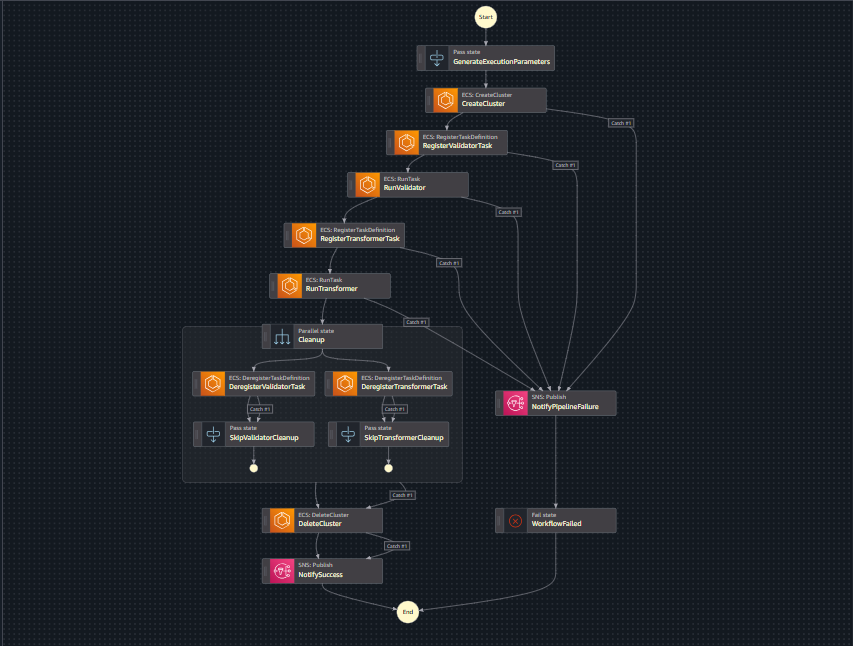

# ECS Event-Driven Data Pipeline

## Overview

This project implements a **real-time**, **event-driven data pipeline** for an e-commerce platform using fully managed AWS services. It ingests transactional data (CSV files) uploaded to Amazon S3, triggers processing using Amazon EventBridge, validates and transforms the data using containerized ECS Fargate tasks, and stores computed KPIs in DynamoDB. The orchestration is managed by AWS Step Functions with full automation, error handling, and resource cleanup. Dashboards are powered by **Amazon QuickSight** and **Power BI** for business intelligence.

---


## Key Features

- **Event-Driven Execution**: S3 uploads trigger the workflow via EventBridge
- **Containerized Processing**: ECS Fargate runs isolated validator and transformer tasks
- **Workflow Automation**: AWS Step Functions orchestrate tasks, retries, and cleanup
- **KPI Storage**: DynamoDB stores category and order-level KPIs
- **Monitoring & Notifications**: Integrated with CloudWatch and SNS
- **Dashboarding**: Visualized using Amazon QuickSight and Power BI
- **Ephemeral Resources**: ECS clusters and tasks are dynamically provisioned and cleaned

---

## Repository Structure

```bash
ecs-event-driven-pipeline/
├── .github/workflows/
│   └── main.yml                    # GitHub Actions for CI/CD
├── step_functions/
│   └── MainStepFn.json          # Step Functions definition
├── ecs/
│   ├── validator/
│   │   ├── Dockerfile
│   │   └── validator.py
│   ├── transformer/
│   │   ├── Dockerfile
│   │   └── transformer.py
├── imgs/
│   ├── Architecture.jpg
│   ├── stepfunctions.svg
│   ├── executed.svg
│   ├── SNS-email.png
│   ├── order_kpi.png
│   └── category_kpi.png
├── data/
│   └── products/
│   └── orders/
│   └── order_items/
├── requirements.txt
├── LICENSE
└── README.md
```

---

## Data Flow & Architecture


1. **S3 Upload** triggers EventBridge
2. **EventBridge** invokes Step Function
3. **Step Function** provisions ECS cluster, runs validator and transformer tasks
4. **Results** are written to DynamoDB and cleaned files back to S3
5. **Monitoring** via CloudWatch & SNS
6. **Dashboards** with Power BI & QuickSight

---

##  Input Format

```csv
order_id,customer_id,order_date,category,product_id,quantity,unit_price,returned
ORD123,CUST001,2025-07-06,Electronics,PROD001,2,199.99,false
```

---

## ECS Task Logic

### Validator Task

- Validates schema and data types
- Rejects malformed rows
- Outputs cleaned data to new S3 prefix
- Logs errors to CloudWatch

### Transformer Task

- Computes:
  - **Category KPIs** (revenue, return rate, AOV)
  - **Order KPIs** (revenue, total orders, unique customers)
- Writes results to DynamoDB

---

## DynamoDB Schema

### CategoryKPIs

| Attribute         | Type           | Description                    |
|------------------|----------------|--------------------------------|
| category          | Partition Key  | Product category               |
| order_date        | Sort Key       | Date of order                  |
| daily_revenue     | Number         | Revenue per category           |
| avg_order_value   | Number         | Avg order value                |
| avg_return_rate   | Number         | Avg return rate                |

### OrderKPIs

| Attribute         | Type   | Description                      |
|------------------|--------|----------------------------------|
| order_date        | Key    | Date                             |
| total_orders      | Number | Number of orders                 |
| total_revenue     | Number | Aggregate order revenue          |
| total_items_sold  | Number | Quantity sold                    |
| return_rate       | Number | Return percentage                |
| unique_customers  | Number | Distinct customers               |

---

## Step Function Workflow


1. **CreateCluster**
2. **Run Validator Task**
3. **Run Transformer Task**
4. **Write to DynamoDB**
5. **Deregister Tasks & Delete Cluster**
6. **Notify Success/Failure via SNS**


---




## Deployment Steps

### Prerequisites

- AWS CLI configured
- Docker installed
- IAM roles for ECS, EventBridge, Step Functions, Lambda
- ECR repositories: `ecs-validator`, `ecs-transformer`

### Setup

```bash
# Clone repo
git clone https://github.com/<your-username>/ecs-event-driven-pipeline.git
cd ecs-event-driven-pipeline

# Create S3 buckets
aws s3 mb s3://your-input-bucket
aws s3 mb s3://your-cleaned-bucket

# Build and push containers
cd ecs/validator
docker build -t validator .
docker push <ecr-uri>/ecs-validator

cd ../transformer
docker build -t transformer .
docker push <ecr-uri>/ecs-transformer

# Set up EventBridge rule and Step Function
aws stepfunctions create-state-machine ...
```

---

## CI/CD with GitHub Actions

- File: `.github/workflows/main.yml`
- Triggered on:
  - Push to `main`
  - Changes to Step Function or workflow files
- Features:
  - JSON validation
  - Auto-deploy Step Function updates

---

## Monitoring and Alerts

- **Logs**:
  - `/aws/ecs/ecs-validator`
  - `/aws/ecs/ecs-transformer`
- **SNS Notifications**:
  - `pipeline-success`
  - `pipeline-failure`


---


## Dashboarding

### Power BI Dashboards

#### Order KPIs


#### Category KPIs


---

## Testing

```bash
# Unit tests
pytest tests/test.py

# Full simulation
./tests/test_pipeline.sh

# Manual Step Function trigger
aws stepfunctions start-execution --input '{"bucket": "your-input-bucket", "key": "input/test.csv"}'
```

---

## Error Handling

- **Validator**: Schema checks, logs to CloudWatch
- **Transformer**: Validation of metrics, no partial writes
- **Step Function**: Retry logic, SNS on failure

---

## Future Improvements

- SQS DLQ for failed files
- Schema registry support
- Frontend KPI dashboard with React
- Redshift/Athena integration

---

## License

MIT License. See `LICENSE`.

---

## Contributing

- Fork this repo
- Create a feature branch
- Submit a PR with proper documentation

---

## Contact

For questions or support, open an issue in the repository.

---


